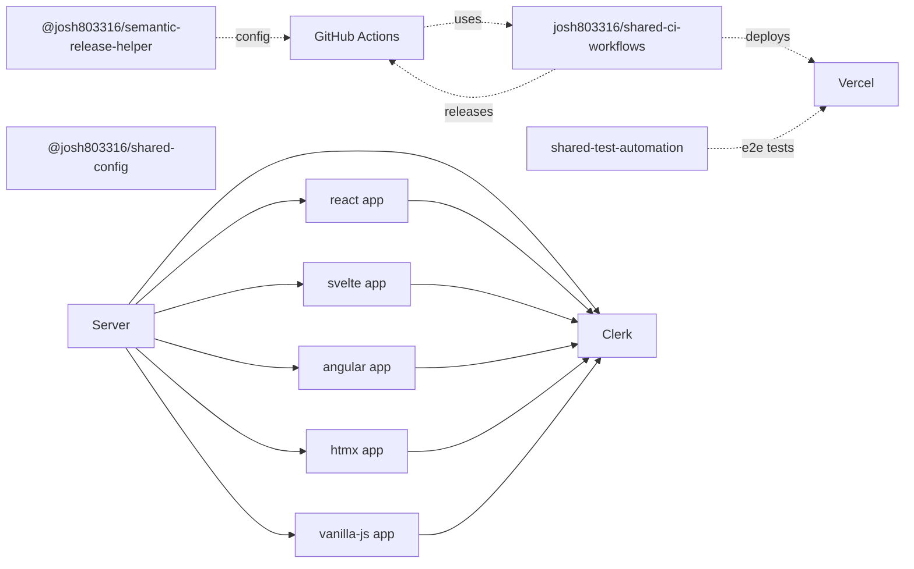

## Elysia Playground

Monorepo playground for comparing **five UI approaches** against one shared API, and for demonstrating a **shared dev‑experience + CI/CD ecosystem**:

- **React** app at `/react`
- **Svelte** app at `/svelte`
- **Angular** app at `/angular`
- **HTMX** app at `/htmx`
- **Vanilla JS** app at `/vanilla-js`

All five frontends talk to the same **Elysia + Bun** backend and Notes data model, and they all share:

- **Shared config** via `@josh803316/shared-config`
- **Shared CI workflows** via `josh803316/shared-ci-workflows`
- **Shared test automation patterns** (this repo is the system‑under‑test)
- **Shared semantic‑release config** via `@josh803316/semantic-release-helper`

### High‑Level Ecosystem Diagram



At a glance:

- **This repo** is the concrete app and reference implementation.
- **Shared libs** live in their own repos and are pulled in as dependencies.
- **Shared CI workflows** are consumed as `uses:`‑style reusable workflows in `.github/workflows/*.yml`.
- **Vercel** hosts preview + production environments; **Clerk** provides authentication; **GitHub Actions** orchestrate deploy + release.

## What This Repo Demonstrates

- Shared backend/API for multiple frontend paradigms
- Clerk authentication for user/private-note flows
- Public/anonymous notes and authenticated private notes
- Admin views/actions via API key-protected routes
- **How to compose Vercel, Clerk, shared libraries, and reusable CI workflows into a repeatable ecosystem**

## Workspace Structure

- `server/` - Elysia API, data access, auth/guards, HTMX routes
- `react/` - React + Vite client
- `svelte/` - SvelteKit client
- `angular/` - Angular client
- `htmx/` - HTMX frontend assets/templates (served by server)
- `vanilla-js/` - Vanilla JS frontend (static HTML/CSS/ES modules, served by server)
- `e2e-tests/` - Playwright e2e tests that treat the deployed app as a black box

## Shared Libraries and Workflows

### `@josh803316/shared-config`

- **What it is**: Centralized linting/formatting/TypeScript/Husky configuration shared across many repos.
- **Where it is used here**:
  - `eslint.config.js` extends the shared ESLint setup.
  - `tsconfig.json` extends the shared TypeScript config.
  - `.husky/*` scripts delegate to Husky hooks provided by `@josh803316/shared-config`.
  - `prettier.config.js` imports the shared Prettier config.
- **Why it matters**: You can onboard new repos into the ecosystem by installing one package and getting a batteries‑included DX (ESLint, TS, Prettier, Husky, lint-staged) with consistent rules.
- **Repo**: `@josh803316/shared-config` on GitHub Packages / npm (private GitHub-hosted package).

### `josh803316/shared-ci-workflows`

- **What it is**: A collection of **reusable GitHub Actions workflows** for Vercel deploys + Linear ticket automation.
- **Where it is used here**:
  - `.github/workflows/vercel-preview.yml`
    - `preview` job uses `josh803316/shared-ci-workflows/.github/workflows/vercel-preview.yml@main` to:
      - Build with `bun run build`.
      - Deploy a **Vercel preview** for each PR (`VERCEL_PROJECT_ID`, `VERCEL_ORG_ID` via `vars`).
    - `linear` job uses `linear-pr-handler.yml@main` to:
      - Move the associated Linear ticket to **In Progress** and attach the preview URL.
  - `.github/workflows/handle-pr-events.yml`
    - Uses `linear-pr-handler.yml@main` to:
      - Transition Linear tickets based on PR review and draft/ready state (In Progress / In Review).
  - `.github/workflows/release.yml`
    - `deploy` job uses `vercel-production.yml@main` for **production deploys to Vercel** on pushes to `main`.
- **Why it matters**: Any repo in the ecosystem can get a full Vercel + Linear workflow by wiring a minimal workflow file that `uses:` these shared definitions.
- **Repo**: `josh803316/shared-ci-workflows` on GitHub.

### `@josh803316/semantic-release-helper`

- **What it is**: A sharable **semantic‑release configuration + plugins** bundle.
- **Where it is used here**:
  - `.releaserc` simply contains:
    - `"extends": "@josh803316/semantic-release-helper"`
  - `.github/workflows/release.yml`:
    - Installs `@josh803316/semantic-release-helper`, `@josh803316/shared-ci-workflows`, and `semantic-release` via `bun add` in CI.
    - Runs `bunx semantic-release` with:
      - `SEMANTIC_RELEASE_PACKAGE=elysia-playground`
      - Linear-related env vars to integrate release notes with Linear.
- **Why it matters**: Every repo gets a consistent release pipeline (versioning, changelogs, GitHub Releases, Linear integration) by extending a single shared config.
- **Repo**: `@josh803316/semantic-release-helper` on GitHub Packages / npm.

### `shared-test-automation`

- **What it is**: A shared **test automation patterns** library (Playwright helpers, test utilities, etc.) used across repos.
- **Where it shows up conceptually here**:
  - `e2e-tests/` exercises this app the same way other repos in the ecosystem are tested.
  - The patterns and directory structure in `e2e-tests/` align with what `shared-test-automation` provides.
- **Why it matters**: CI can run the **same style of black‑box tests** (against Vercel preview or production URLs) across multiple apps, using consistent helpers and conventions.
- **Repo**: `shared-test-automation` on GitHub.

## Commit Convention

Commits follow **Conventional Commits**. Linear ticket refs (`[ELY-N]`) are **always optional** — both forms are valid:

```
fix: [ELY-5] Fix the bug           # with ticket
feat: Add new feature              # without ticket
feat(scope): [ELY-12] New thing   # with scope and ticket
```

When a commit or PR title contains an `[ELY-N]` ref, the CI automation handles Linear state transitions automatically:

| GitHub event                         | Linear ticket action                              |
| ------------------------------------ | ------------------------------------------------- |
| PR opened → Vercel preview deployed  | → **In Progress** + preview URL posted as comment |
| PR converted to draft                | → **In Progress**                                 |
| PR marked ready for review           | → **In Review**                                   |
| PR review: changes requested         | → **In Progress**                                 |
| Merged to `main` + release published | → **Done**                                        |

Commits without ticket refs pass through all steps unchanged.

## Entry Points

When running locally, the backend serves a root landing page at `/` linking to:

- `/react`
- `/svelte`
- `/angular`
- `/htmx`
- `/vanilla-js`

## Prerequisites

- [Bun](https://bun.sh/)
- Clerk app/keys for authenticated flows

## Setup

```bash
# Install root + workspace dependencies
bun run install:all
```

Create env files and fill values:

- `server/.env`
- `react/.env` (if needed for local overrides)
- `svelte/.env` (if needed for local overrides)
- `angular/.env` (if needed for local overrides)

Typical required **server** values:

- `CLERK_SECRET_KEY`
- `CLERK_PUBLISHABLE_KEY`
- `CLERK_FRONTEND_API` (e.g. `ample-garfish-72.clerk.accounts.dev`)
- `ADMIN_API_KEY`

For **frontend** Clerk usage:

- `VITE_CLERK_PUBLISHABLE_KEY` (React/Svelte as needed)
- The Vanilla JS app reads `CLERK_PUBLISHABLE_KEY` and `CLERK_FRONTEND_API` indirectly from `server/.env` via a small `/vanilla-js/env.js` helper and does **not** hardcode any keys in the static assets.

## Development

```bash
# Run multiple apps (default)
bun run dev

# Targeted combinations
bun run dev:react
bun run dev:svelte
bun run dev:angular
bun run dev:htmx
bun run dev:vanilla-js
bun run dev:server
```

## Testing

```bash
# Run all workspace tests
bun run test

# Run server-only tests
bun run test:server
```

## Build

```bash
# Build all workspaces
bun run build

# Build specific workspaces
bun run build:react
bun run build:svelte
bun run build:angular
bun run build:server
```

## API Snapshot

- `GET /api/public-notes` - list public notes
- `POST /api/public-notes` - create anonymous public note
- `GET /api/notes` - list signed-in user notes
- `POST /api/notes` - create user note
- `PUT /api/private-notes` - create private note
- `GET /api/private-notes` - list private notes for signed-in user
- `GET /api/notes/all` - admin list all notes (`X-API-Key`)

## License

MIT
